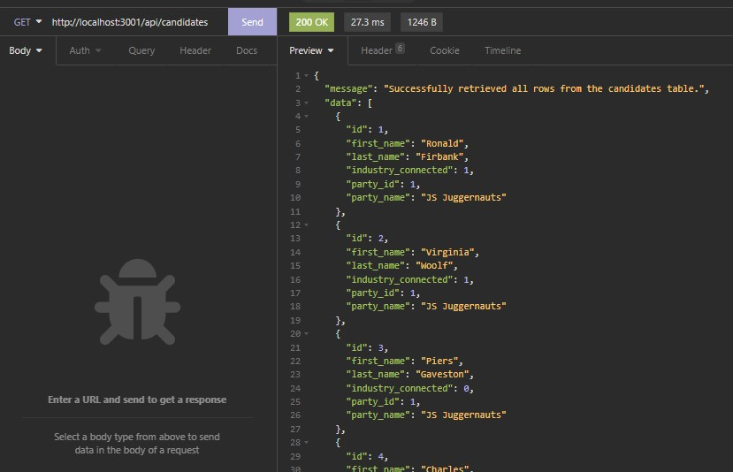
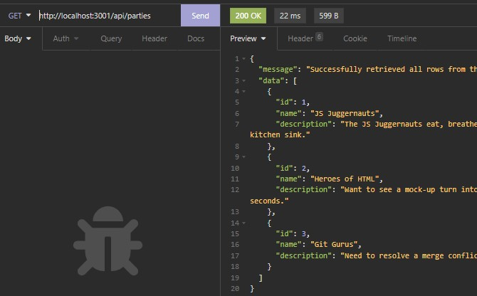
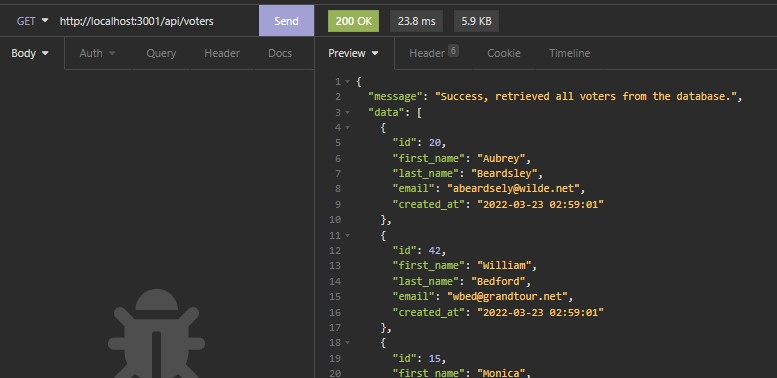
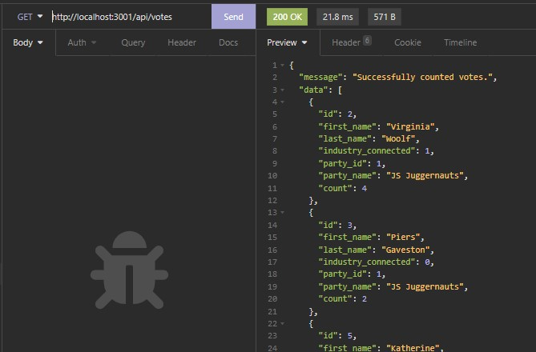
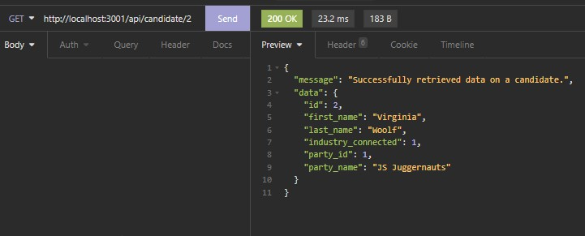

# U-Develop-It

Richard Ay (October 2020, *updated March 2022*)

## Table of Contents
* [Installation Instructions](#installation-instructions)
* [Usage Instructions](#usage-instructions)
* [Application Walk Through](#application-walk-through)
* [Technologies Used](#technologies-used)
* [Deployment Link](#deployment-link)
* [Application Source Code Setup and Structure](#application-source-code-setup-and-structure)
* [Application Screen Shots](#application-screen-shots)

   
## Installation Instructions
This application is a 'back-end' project only, illustrating the setup of a database and a set of queries (routes).

## Usage Instructions
    
    From the development environment (VS Code), issue the command: npm start.  Then use Insomnia to test the various routes.

## Application Walk Through
See the various Insomnia screen shots below.

## Technologies Used

* Node.js
* Express
* Jest
* Inquirer
* MySQL
* Schema, seed files
* Insomnia Core

## Deployment Link
The application is not deployed.  Download the files for this project and follow the 'usage instructions' above.

## Application Source Code Setup and Structure
The directory structure is setup as follows:
* Root Directory: contains the package files, gitignore, and /db, /__tests__, /utils, /routes
* /db contains the database, the schema, a seed file, and the Javascript file to access the database
* __tests__ contains the (TDD) unit tests for the application.
* /utils contains a utility file to verify user (query) input.
* /routes contains /apiRoutes, which contains the Javascript files for the various application routes.

## Application Screen Shots

 Image of the Insomnia routes. 
 Image of the Get_All_Candidates route. 
 Image of the Get_All_Parties route. 
 Image of the Get_All_Voters route. 
 Image of the Get_All_Votes route. 
 Image of the Get_Candidate_By_ID route. 

